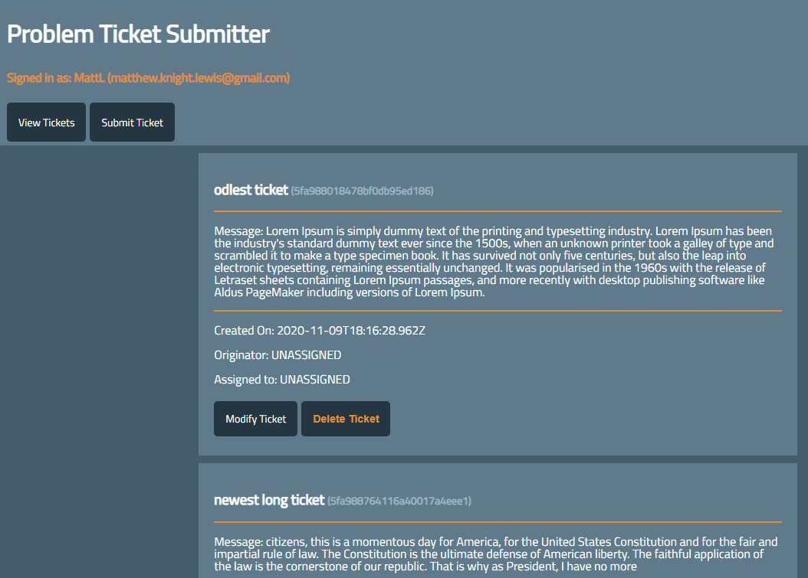

# Problem Ticket App
This web app allows users to create and upload "problem tickets" to a database.
It leverages Discord's Oauth2 API to authenticate users and populate a user database with their information, which the app then uses to assign problem tickets to "fixers".

# Phase II
I'm currently working on 2 new functionalities:
- Allowing non-registered users to view tickets.
- Restricting non-registered users from submitting or modifying tickets.
- Removing the 'Delete' Option in favor of a "Close Out" modify route

### Browser View

### Phone View

